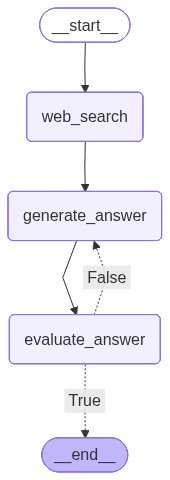

# 🧠 QnA Agent — Reflection-Based LangGraph System

A multi-step Question Answering Agent built using **LangGraph + LangChain + OpenAI**.

This project demonstrates a structured, state-driven AI system that:

- 🔎 Generates answers using LLMs  
- 📊 Evaluates answer quality using structured output  
- 🔁 Improves low-confidence answers using feedback  
- 🧩 Uses graph-based orchestration  

---

## 🚀 Features

- Multi-node LangGraph architecture
- Structured output with Pydantic
- Confidence scoring (0–1)
- Feedback-driven answer refinement
- Clean, JSON-serializable state management
- Modular and extensible design

---

## 🏗 Architecture

